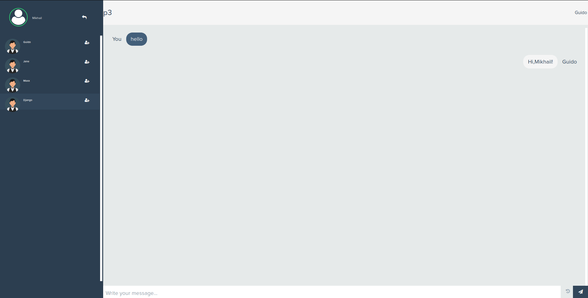

# CHAT BOX
Этот проект является примером для моего резюме и портфолио.

Для создания использовалось Django3, django-channels, WebSocket, PostgreSQL.

## Использование
Проект развернут на VPS http://188.225.37.184/ для ознакомления.

## Установка
Для установки необходимо:
- клонировать репозиторий `git clone https://github.com/DontTouchMyMind/simple_chat.git`
- установить необходимые библиотеки `pip install -r requirements.txt`
- создать и применить миграции `python3 manage.py makemigrations` и `python3 manage.py migrate`
- если проект устанавливается локально, необходимо запустить Redis `docker run -p 6379:6379 -d redis:5`
- запустить проект локально `python3 manage.py runserver`

Не забудьте добавить в файл settings.py (или создать файл local_settings.py) переменные:
- SECRET_KEY
- DEBUG
- ALLOWED_HOSTS = []
- DATABASES
- STATICFILES_DIRS
- STATIC_ROOT

Файлы с настройкой сервера Ubuntu 18.04 располагаются в папке **deploy**.

## Функции
- Вы можете создавать комнаты
- Добавлять пользователей в комнату для общения
- Добавлена возможность блокировать пользователя из панели администратора